# Generative AI RAG Agent using LangGraph

This project implements a **Retrieval-Augmented Generation (RAG)**–based AI agent built with **LangGraph**, **LangChain**, and **ChromaDB**.  
The agent intelligently answers user queries using a **local knowledge base**, performs **reflection scoring**, and provides **interactive visualization** through **Streamlit**.

---

##  Overview

The **Generative AI RAG Agent** uses a hybrid AI approach combining:
- **Graph-based workflow orchestration (LangGraph)**  
- **Document retrieval with vector embeddings (LangChain + ChromaDB)**  
- **Text generation and reasoning (Hugging Face Transformers)**  
- **Reflection and self-evaluation (LLM-based scoring)**  
- **Interactive UI (Streamlit)**  

It is designed to answer factual, reasoning, or knowledge-based questions with transparency and explainability.

---

##  Tech Stack

| Component | Technology |
|------------|-------------|
| Workflow Orchestration |  [LangGraph](https://www.langchain.com/langgraph) |
| Retrieval & RAG Pipeline |  [LangChain](https://www.langchain.com/) |
| Vector Database |  [ChromaDB](https://www.trychroma.com/) |
| Embeddings Model |  Hugging Face – `sentence-transformers/all-MiniLM-L6-v2` |
| LLM Engine |  GPT-4o-mini / HuggingFace text generation models |
| UI |  [Streamlit](https://streamlit.io/) |
| Evaluation |  Reflection Scoring via LangChain Evaluator |
| Logging |  Custom log utility (`src/utils.py`) |

---

---

##  Workflow Diagram (LangGraph DAG)

```mermaid
graph TD
    A[🧩 Start / Query Input] --> B[🧭 Planner Node]
    B -->|Needs Retrieval| C[📚 Retriever Node]
    B -->|Direct Generation| D[💬 Answer Generator]
    C --> D
    D --> E[🔍 Reflection Node]
    E --> F[✅ Final Output]
```

