# Generative AI RAG Agent using LangGraph

This project implements a **Retrieval-Augmented Generation (RAG)**–based AI agent built with **LangGraph**, **LangChain**, and **ChromaDB**.  
The agent intelligently answers user queries using a **local knowledge base**, performs **reflection scoring**, and provides **interactive visualization** through **Streamlit**.

---

##  Overview

The **Generative AI RAG Agent** uses a hybrid AI approach combining:
- **Graph-based workflow orchestration (LangGraph)**  
- **Document retrieval with vector embeddings (LangChain + ChromaDB)**  
- **Text generation and reasoning (Hugging Face Transformers)**  
- **Reflection and self-evaluation (LLM-based scoring)**  
- **Interactive UI (Streamlit)**  

It is designed to answer factual, reasoning, or knowledge-based questions with transparency and explainability.

---

##  Tech Stack

| Component | Technology |
|------------|-------------|
| Workflow Orchestration |  [LangGraph](https://www.langchain.com/langgraph) |
| Retrieval & RAG Pipeline |  [LangChain](https://www.langchain.com/) |
| Vector Database |  [ChromaDB](https://www.trychroma.com/) |
| Embeddings Model |  Hugging Face – `sentence-transformers/all-MiniLM-L6-v2` |
| LLM Engine |  GPT-4o-mini / HuggingFace text generation models |
| UI |  [Streamlit](https://streamlit.io/) |
| Evaluation |  Reflection Scoring via LangChain Evaluator |
| Logging |  Custom log utility (`src/utils.py`) |

---


---

##  Workflow Diagram (LangGraph DAG)

```mermaid
graph TD
    A[🧩 Start / Query Input] --> B[🧭 Planner Node]
    B -->|Needs Retrieval| C[📚 Retriever Node]
    B -->|Direct Generation| D[💬 Answer Generator]
    C --> D
    D --> E[🔍 Reflection Node]
    E --> F[✅ Final Output]
```



---
## Node Descriptions

| Node          | Role                                                                       |
| ------------- | -------------------------------------------------------------------------- |
| **Planner**   | Determines whether retrieval is required or zero-shot generation is enough |
| **Retriever** | Searches ChromaDB for relevant document chunks                             |
| **Answer**    | Generates response using LLM (Hugging Face or GPT-4o-mini)                 |
| **Reflect**   | Evaluates response for completeness and relevance                          |
| **Output**    | Returns final answer + reflection score                                    |

---

## Features
- RAG Pipeline with Dynamic Document Loading
- Automatic Text Cleaning, Chunking, and Embedding
- Vector Search with Similarity Threshold Filtering
- Fallback Zero-Shot Answering (when no docs found)
- Reflection Scoring (Relevance + Completeness)
- Interactive Streamlit UI
- Robust Logging and Error Handling

---

##  Installation & Setup

### 1️. Clone Repository
```bash
git clone https://github.com/DattatrayBodake25/langgraph-rag-agent.git
cd langgraph-rag-agent
```

### 2️. Create Virtual Environment
```
python -m venv venv
venv\Scripts\activate   # (Windows)
# source venv/bin/activate  (Mac/Linux)
```

### 3️. Install Dependencies
```
pip install -r requirements.txt
```

# 4️. Add Environment Variables
Create a .env file in the root directory:
```ini
OPENAI_API_KEY=your_openai_api_key_here
```

### 5️. Add Knowledge Base
Put your .txt or .pdf files into the /data folder.
Example:
```kotlin
data/
 ├── renewable_energy.txt
 ├── ai_in_biodiversity.pdf
 └── transportation_systems.txt
```

---

## Running the Application
### Option 1 – CLI Mode
```bash
python main.py "Explain AI applications in biodiversity"
```

### Option 2 – Streamlit Web App
```bash
streamlit run app.py
```
Then open: http://localhost:8501 in your browser.

---

## Example Outputs
### On-topic Query
- Query: What are the applications of AI in transportation?
- Result:
   - Retrieved 5 relevant chunks (scores 0.74–0.91)
   - Reflection Score: 0.75
   - Generated a complete, domain-relevant answer.

### Off-topic Query
- Query: Who won the Men's T20 World Cup 2016?
- Result:
  - Retrieved 0 relevant documents
  - Reflection Score: 0.0
  - Response: "I don't have enough information based on the provided data."

---

## Reflection Scoring
| Score   | Meaning                             |
| ------- | ----------------------------------- |
| **1.0** | Highly relevant and complete answer |
| **0.5** | Partially relevant or incomplete    |
| **0.0** | Off-topic or irrelevant answer      |

---

## Key Improvements Implemented
- Fixed retriever to use .invoke() instead of deprecated .get_relevant_documents()
- Added similarity threshold filter (default = 0.6) to suppress irrelevant chunks
- Clean text preprocessing pipeline (noise removal, normalization)
- Automatic persistence + loading of ChromaDB
- Modular graph nodes for planning, retrieval, generation, and reflection
- Graceful fallbacks for off-topic or knowledge-missing queries
- Improved logging system with timestamps and node-level context
- Streamlit interface with dynamic display of answers, scores, and retrieved docs

---

## Commands Summary
```bash
# Initialize repo
git init
git remote add origin https://github.com/DattatrayBodake25/langgraph-rag-agent.git
git add .
git commit -m "Initial commit - LangGraph RAG Agent"
git branch -M main
git push -u origin main

# Run the app
streamlit run app.py

# Test CLI
python main.py "What is solar thermal?"
```

---

## Future Enhancements
- Multi-modal document support (images + text)
- Incremental vector store update pipeline
- Knowledge graph integration
- Streamlit analytics dashboard
- Chat history memory (LangGraph Memory Node)

---

## Conclusion
This project demonstrates a production-grade LangGraph RAG workflow with
retrieval, reasoning, and self-reflection — ready for research, enterprise, or educational deployment.

→ “Think, Retrieve, Generate, Reflect.”

---
